# zkWiki Anonymous - x402 Protocol Implementation

**Gasless anonymous micropayments for content creators using x402 protocol**

Pay $0.01-0.10 per article **without gas fees** using x402 HTTP 402 Payment Required standard with EIP-3009 USDC transfers. Built on **Arbitrum One mainnet** with zero-knowledge proofs for reader privacy.

**🟢 Live on Arbitrum One Mainnet:**

| Component | Address/URL | Network | Protocol |
|-----------|-------------|---------|----------|
| zkWiki Contract | [`0x5748ebAAA22421DE872ed8B3be61fc1aC66F3e92`](https://arbiscan.io/address/0x5748ebAAA22421DE872ed8B3be61fc1aC66F3e92) | Arbitrum One | Solidity |
| USDC Contract | [`0xaf88d065e77c8cC2239327C5EDb3A432268e5831`](https://arbiscan.io/address/0xaf88d065e77c8cC2239327C5EDb3A432268e5831) | Arbitrum One | EIP-3009 |
| x402 Facilitator | `http://localhost:3005` | Local | x402 Standard |

**Deployment Details:**
- Deployed: November 10, 2025
- Payment Protocol: x402 (HTTP 402 Payment Required)
- Payment Token: USDC (Circle native with EIP-3009 support)
- Gas Model: Gasless (facilitator pays gas via EIP-3009)
- Privacy: Zero-knowledge nullifiers prevent wallet tracking
- Network: Arbitrum One (42161)

---

## 🏗️ System Architecture

```mermaid
graph TB
    subgraph "Frontend Layer"
        UI[Next.js 14 App]
        WC[RainbowKit Wallet]
        ZK[zkProof Generator<br/>Deterministic Nullifiers]
        API[API Routes<br/>x402 Protocol Handler]
    end

    subgraph "x402 Payment Layer"
        FAC[x402 Facilitator<br/>Port 3005]
        VERIFY[/verify Endpoint<br/>Off-chain Validation]
        SETTLE[/settle Endpoint<br/>On-chain Settlement]
    end

    subgraph "Blockchain Layer - Arbitrum One Mainnet"
        WP[zkWiki Contract<br/>Solidity<br/>0x5748...3e92]
        USDC[Circle USDC<br/>EIP-3009<br/>0xaf88...8831]
    end

    subgraph "Data Layer"
        IPFS[IPFS/Pinata<br/>Encrypted Content]
        Chain[On-Chain Storage<br/>Nullifiers & Metadata]
    end

    UI -->|1. Request Article| API
    API -->|2. Return 402 + Payment Requirements| UI
    UI -->|3. Generate zkProof| ZK
    ZK -->|4. Nullifier Hash| UI
    UI -->|5. Sign EIP-3009 Authorization| WC
    WC -->|6. EIP-712 Signature| UI
    UI -->|7. Retry with X-PAYMENT Header| API
    API -->|8. POST /verify| VERIFY
    VERIFY -->|9. Validate Signature| FAC
    FAC -->|10. Verification Result| API
    API -->|11. POST /settle| SETTLE
    SETTLE -->|12. transferWithAuthorization| USDC
    USDC -->|13. Transfer USDC| WP
    WP -->|14. Mark Nullifier Used| Chain
    API -->|15. Return Content| UI
    UI -->|16. Fetch from IPFS| IPFS

    style FAC fill:#f9f,stroke:#333,stroke-width:3px
    style USDC fill:#9cf,stroke:#333,stroke-width:3px
    style WP fill:#f96,stroke:#333,stroke-width:3px
    style ZK fill:#fcf,stroke:#333,stroke-width:2px
```

## 🔄 Sequence Diagrams

### Article Publishing Flow

```mermaid
sequenceDiagram
    actor Creator
    participant UI as Frontend
    participant Wallet as RainbowKit
    participant Contract as Stylus Contract
    participant IPFS as IPFS Storage
    participant Arbitrum as Arbitrum Sepolia

    Creator->>UI: Write article + set price
    UI->>Creator: Show preview
    Creator->>UI: Click "Publish"

    UI->>Wallet: Request wallet connection
    Wallet->>Creator: Show wallet options
    Creator->>Wallet: Connect wallet
    Wallet-->>UI: Connected (address)

    UI->>IPFS: Upload encrypted content
    IPFS-->>UI: Return IPFS hash

    UI->>Contract: publish_article(preview, ipfs_hash, price)
    Contract->>Contract: Validate price (0.01-0.10 ETH)
    Contract->>Contract: Generate article_id
    Contract->>Contract: Store article data

    Contract->>Arbitrum: Execute WASM transaction
    Arbitrum-->>Contract: Transaction confirmed
    Contract-->>UI: Article ID + tx hash

    UI->>Creator: ✅ Published! Show tx details

    Note over UI,Arbitrum: Gas cost: ~$0.005 (90% cheaper than Solidity)
```



### Anonymous Article Unlocking Flow (x402 Protocol)

```mermaid
sequenceDiagram
    actor Reader
    participant UI as Frontend
    participant API as API Route
    participant ZK as zkProof Generator
    participant Wallet as Wallet
    participant FAC as x402 Facilitator
    participant USDC as Circle USDC
    participant Contract as zkWiki Contract
    participant IPFS as IPFS Storage

    Reader->>UI: Browse articles
    UI->>Contract: getArticle(id)
    Contract-->>UI: [creator, price, unlocks, preview, ipfsHash]
    UI->>Reader: Show article preview + "$0.05 USDC"

    Reader->>UI: Click "Unlock Anonymously"

    UI->>API: GET /api/articles/0 (no payment header)
    API->>Contract: Read article metadata
    API-->>UI: HTTP 402 Payment Required + Payment Details
    Note over API,UI: x402 Headers:<br/>X-Payment-Network: arbitrum<br/>X-Payment-Token: USDC<br/>X-Payment-Amount: 50000

    UI->>ZK: Generate nullifier(wallet, article_id, nonce)
    Note over ZK: Deterministic hash:<br/>keccak256(wallet || article || nonce)
    ZK-->>UI: nullifier (0xd1ec...4a49)

    UI->>Wallet: Sign EIP-3009 transferWithAuthorization
    Note over Wallet: EIP-712 Signature:<br/>Domain: "USD Coin"<br/>Type: TransferWithAuthorization
    Wallet-->>UI: signature (v, r, s)

    UI->>API: GET /api/articles/0 + X-PAYMENT header
    Note over UI,API: Payment Payload:<br/>- nullifier<br/>- zkProof<br/>- EIP-712 signature<br/>- authorization details

    API->>API: Validate payment structure
    API->>Contract: Check nullifier not used
    Contract-->>API: Nullifier fresh ✓

    API->>FAC: POST /verify (x402 standard)
    Note over API,FAC: paymentPayload + paymentRequirements
    FAC->>FAC: Verify EIP-712 signature
    FAC->>FAC: Recover signer address
    FAC-->>API: isValid: true, payer: 0x952...3B5

    API->>FAC: POST /settle (execute payment)
    FAC->>USDC: transferWithAuthorization(from, to, value, v, r, s)
    Note over USDC: EIP-3009 Gasless Transfer:<br/>Facilitator pays gas
    USDC->>USDC: Verify signature against domain
    USDC->>Contract: Transfer 50,000 USDC (0.05 USD)
    USDC-->>FAC: Transaction hash
    FAC->>Contract: Mark nullifier used
    FAC-->>API: success: true, tx: 0xabc...def

    API->>IPFS: Fetch encrypted content
    IPFS-->>API: Return full article
    API-->>UI: HTTP 200 + Content + Transaction Details

    UI->>Reader: 🎉 Article Unlocked! (No gas fees paid)

    Note over Reader,Contract: Privacy: Wallet → Nullifier (one-way hash)
    Note over FAC,USDC: Gasless: Facilitator pays all gas fees
    Note over USDC: Payment: USDC transferred via EIP-3009
```



### Creator Earnings Withdrawal Flow


### Zero-Knowledge Proof Generation (Detailed)


### Data Flow & Storage Architecture


### Gas Optimization Flow (Stylus vs Solidity)


### Complete System Integration


---

## 🎯 What This Does

- **Creators**: Publish articles with paywalled content ($0.01-0.10 USDC per unlock)
- **Readers**: Unlock articles anonymously using zero-knowledge nullifiers
- **Gasless Payments**: x402 protocol with EIP-3009 - readers pay ZERO gas fees
- **No Tracking**: Deterministic nullifiers prevent wallet address correlation
- **Instant Settlement**: Facilitator verifies off-chain, settles on-chain in one transaction

## 💳 x402 Payment Protocol

zkWiki implements the [x402 standard](https://www.x402.org/) - HTTP 402 Payment Required for web payments.

### How x402 Works

1. **402 Response**: API returns HTTP 402 with payment requirements
   ```json
   {
     "error": "Payment Required",
     "payment": {
       "network": "arbitrum",
       "asset": "0xaf88...8831",  // USDC
       "payTo": "0xc256...8228f",  // Creator
       "maxAmountRequired": "50000"  // 0.05 USDC
     }
   }
   ```

2. **Payment Envelope**: Client creates EIP-3009 authorization
   ```typescript
   {
     paymentPayload: {
       scheme: "exact",
       network: "arbitrum",
       payload: {
         signature: "0xf86e...",  // EIP-712 signature
         authorization: {
           from, to, value, validAfter, validBefore, nonce
         }
       }
     }
   }
   ```

3. **Verification**: Facilitator validates signature off-chain
   - Recovers signer address
   - Verifies payment amount matches requirements
   - Returns `isValid: true/false`

4. **Settlement**: Facilitator executes payment on-chain
   - Calls `USDC.transferWithAuthorization()`
   - Facilitator pays gas (EIP-3009 gasless transfer)
   - Marks nullifier as used to prevent double-spend

5. **Content Delivery**: API returns content with transaction proof

### Why x402 + EIP-3009?

- ✅ **Zero Gas Fees**: Facilitator pays all gas, readers only approve USDC transfer
- ✅ **Privacy**: Wallet address never revealed, only nullifier hash stored
- ✅ **Standard Protocol**: Follows x402 spec for HTTP payment flows
- ✅ **Secure**: EIP-712 signatures with proper domain separation
- ✅ **Efficient**: Single transaction combines verification + settlement

---

## 📁 Project Structure

```
wikipay-anonymous/
├── frontend/                    # Next.js 14 App Router
│   ├── src/
│   │   ├── app/
│   │   │   ├── page.tsx        # Landing page
│   │   │   ├── publish/        # Create article (TODO)
│   │   │   ├── article/[id]/   # View/unlock article (TODO)
│   │   │   └── dashboard/      # Creator earnings (TODO)
│   │   ├── components/ui/      # shadcn/ui components
│   │   └── lib/
│   │       ├── wagmi.ts        # Wagmi configuration
│   │       └── contracts.ts    # Contract ABIs
│   └── package.json
├── contracts/                   # ✅ Arbitrum Stylus (Rust/WASM)
│   ├── src/
│   │   └── lib.rs              # Main zkWiki contract (188 lines)
│   ├── Cargo.toml              # Rust dependencies
│   ├── rust-toolchain.toml     # Rust 1.91.0
│   ├── .cargo/config.toml      # WASM build config
│   ├── wikipay-abi.json        # Contract ABI
│   ├── DEPLOYMENT.md           # Deployment details
│   └── README.md               # Full contract documentation
└── docs/
    └── IMPLEMENTATION-PLAN.md  # Development roadmap
```

---

## 🚀 Quick Start

### Prerequisites

- Node.js 18+
- Arbitrum Sepolia ETH ([faucet](https://www.alchemy.com/faucets/arbitrum-sepolia))
- WalletConnect Project ID ([get one free](https://cloud.walletconnect.com))

### 1. Install Dependencies

```bash
# Frontend
cd frontend
npm install
```

### 2. Setup Environment

```bash
# Copy example env file
cp frontend/.env.local.example frontend/.env.local

# Edit frontend/.env.local with deployed Stylus contract
NEXT_PUBLIC_WIKIPAY_ADDRESS=0xab60b91ecb1281Ff9B53A9a3FBBfe8C93afB72b3
NEXT_PUBLIC_WALLETCONNECT_PROJECT_ID=your_project_id_here
NEXT_PUBLIC_ARBITRUM_SEPOLIA_RPC=https://sepolia-rollup.arbitrum.io/rpc
```

### 3. Run Frontend

```bash
cd frontend
npm run dev
```

Open [http://localhost:3000](http://localhost:3000)

### 4. Deploy Your Own Stylus Contract (Optional)

```bash
cd contracts

# Setup environment
cp .env.example .env
# Edit .env with your private key

# Install Rust and cargo-stylus
curl --proto '=https' --tlsv1.2 -sSf https://sh.rustup.rs | sh
cargo install cargo-stylus

# Build and deploy
cargo build --target wasm32-unknown-unknown --release
cargo stylus deploy \
  --private-key $PRIVATE_KEY \
  --endpoint https://sepolia-rollup.arbitrum.io/rpc \
  --wasm-file target/wasm32-unknown-unknown/release/wikipay_contracts.wasm
```

See [contracts/README.md](./contracts/README.md) for full deployment guide.

---

## 🧪 Testing Flow

### As a Creator:

1. Connect wallet (RainbowKit)
2. Go to **/publish**
3. Enter article title, preview text, full content
4. Set unlock price ($0.01-0.10)
5. Click "Publish" → Transaction creates article on-chain

### As a Reader:

1. Browse articles on homepage
2. Click article → See preview + "Unlock for $0.01"
3. Click "Unlock Anonymously"
   - Frontend generates zkProof (1-2 seconds)
   - Proof proves payment without revealing wallet address
   - Nullifier prevents unlocking same article twice
4. Full article content revealed

### Verification:

```bash
# Check article storage
cast call $CONTRACT_ADDRESS "getArticle(uint256)" 1 --rpc-url https://sepolia-rollup.arbitrum.io/rpc

# Check creator earnings
cast call $CONTRACT_ADDRESS "creatorEarnings(address)" $CREATOR_ADDRESS --rpc-url https://sepolia-rollup.arbitrum.io/rpc

# Verify nullifier used (prevents double-spend)
cast call $CONTRACT_ADDRESS "isNullifierUsed(bytes32)" $NULLIFIER --rpc-url https://sepolia-rollup.arbitrum.io/rpc
```

---

## 🔒 How Zero-Knowledge Works

### Anonymous Payment Circuit (Plonky2)

**Public Inputs** (visible on-chain):
- `article_id`: Which article to unlock
- `payment_amount`: $0.01 in wei
- `nullifier`: Hash to prevent double-spend

**Private Inputs** (secret):
- `wallet_address`: Your actual wallet (never revealed)
- `secret_nonce`: Random value for privacy

**Constraints** (zkProof verifies):
1. Payment matches article price
2. Nullifier = Hash(wallet + article + nonce)
3. Wallet has sufficient balance

**Result**: Contract verifies proof without knowing who paid.

---

## 📊 Gas Costs (Arbitrum Sepolia)

### Stylus (Current - WASM)

| Operation | Estimated Gas | Cost (0.1 gwei) | Savings vs Solidity |
|-----------|---------------|-----------------|---------------------|
| Publish article | ~50K gas | ~$0.005 | 67% |
| Unlock article | ~30K gas | ~$0.003 | 70% |
| ZK Proof Verify | ~80K gas | ~$0.008 | 90% |
| Withdraw earnings | ~15K gas | ~$0.0015 | 70% |

**Why Stylus?** Arbitrum Stylus executes WASM code directly, providing 10x faster execution and 90% gas savings compared to EVM bytecode.

---

## 🛠️ Development

### Build Stylus Contract

```bash
cd contracts

# Build WASM contract
cargo build --target wasm32-unknown-unknown --release

# Check contract validity
cargo stylus check \
  --endpoint https://sepolia-rollup.arbitrum.io/rpc \
  --wasm-file target/wasm32-unknown-unknown/release/wikipay_contracts.wasm
```

### Run Frontend Dev Server

```bash
cd frontend
npm run dev
```

### Build Frontend for Production

```bash
cd frontend
npm run build
```

---

## 📚 Tech Stack

### Frontend
- **Next.js 14**: App Router with TypeScript and API Routes
- **Tailwind CSS**: Utility-first styling
- **shadcn/ui**: Component library
- **Wagmi v2**: React hooks for Ethereum
- **RainbowKit**: Wallet connection UI
- **Viem**: TypeScript Ethereum library for EIP-712 signing

### Payment Protocol
- **x402**: HTTP 402 Payment Required standard
- **EIP-3009**: Gasless USDC transfers (transferWithAuthorization)
- **EIP-712**: Typed structured data signing
- **Circle USDC**: Native USDC on Arbitrum One with EIP-3009 support
- **selfx402-framework**: x402 facilitator implementation

### Smart Contracts
- **Solidity**: zkWiki contract on Arbitrum One mainnet
- **Arbitrum One (42161)**: L2 mainnet deployment
- **USDC Contract**: `0xaf88d065e77c8cC2239327C5EDb3A432268e5831`
- **zkWiki Contract**: `0x5748ebAAA22421DE872ed8B3be61fc1aC66F3e92`

### Privacy & Security
- **Deterministic Nullifiers**: keccak256(wallet || article || nonce)
- **Zero Gas**: EIP-3009 meta-transactions (facilitator pays gas)
- **Domain Separation**: EIP-712 with "USD Coin" domain for signature verification

---

## 🚢 Deployment

### Smart Contract (Arbitrum Sepolia)

```bash
cd contracts

# Configure .env with your private key
cp .env.example .env
# Edit .env and add your PRIVATE_KEY

# Install Rust toolchain
curl --proto '=https' --tlsv1.2 -sSf https://sh.rustup.rs | sh
rustup target add wasm32-unknown-unknown
cargo install cargo-stylus

# Build and deploy Stylus contract
cargo build --target wasm32-unknown-unknown --release
cargo stylus deploy \
  --private-key $PRIVATE_KEY \
  --endpoint https://sepolia-rollup.arbitrum.io/rpc \
  --wasm-file target/wasm32-unknown-unknown/release/wikipay_contracts.wasm

# Cache for cheaper calls (recommended)
cargo stylus cache bid <CONTRACT_ADDRESS> 0 \
  --private-key $PRIVATE_KEY \
  --endpoint https://sepolia-rollup.arbitrum.io/rpc
```

See [contracts/README.md](./contracts/README.md) for detailed instructions.

### Frontend (Vercel)

```bash
cd frontend
vercel --prod
```

**Environment Variables** (Vercel):
- `NEXT_PUBLIC_WIKIPAY_ADDRESS=0xab60b91ecb1281Ff9B53A9a3FBBfe8C93afB72b3`
- `NEXT_PUBLIC_ARBITRUM_SEPOLIA_RPC=https://sepolia-rollup.arbitrum.io/rpc`
- `NEXT_PUBLIC_WALLETCONNECT_PROJECT_ID=<your_project_id>`

---

## 📖 API Reference

### Stylus Contract Methods

The deployed Stylus contract at `0xab60b91ecb1281Ff9B53A9a3FBBfe8C93afB72b3` implements:

**Write Functions:**
```rust
// Publish article (anyone can publish)
publishArticle(preview: String, encrypted_content: String, price: U256) -> U256

// Unlock article with ZK proof (payable) - FIXED: uses bytes32 instead of bytes
unlockArticleAnonymous(article_id: U256, nullifier: FixedBytes<32>, proof: FixedBytes<32>) -> bool

// Withdraw creator earnings
withdrawEarnings() -> U256
```

**Read Functions:**
```rust
// Get article details
getArticle(article_id: U256) -> (Address, U256, U256, String)

// Get encrypted content (call after unlocking)
getEncryptedContent(article_id: U256) -> String

// Get creator earnings
getCreatorEarnings(creator: Address) -> U256

// Check nullifier usage
isNullifierUsed(nullifier: FixedBytes<32>) -> bool

// Get total article count
getTotalArticles() -> U256
```

**Key Differences from Solidity**:
- Proof parameter: `bytes32` instead of `bytes` (better ABI compatibility)
- Return type: `bool` instead of `string` (content fetched separately)
- Separate function: `getEncryptedContent()` for retrieving full content

Full ABI available in [contracts/wikipay-abi.json](./contracts/wikipay-abi.json)

---

## 🔐 Security

### Stylus Contract Security
- **Memory safety**: Rust's ownership system prevents common vulnerabilities
- **Type safety**: Compile-time guarantees for data types and operations
- **Access control**: Only creators can withdraw their earnings
- **Input validation**: Article prices must be 0.01-0.10 ETH
- **Nullifier tracking**: Prevents double-unlock attacks
- **WASM sandbox**: Execution isolated from host environment

### zkProof Security (Production)
- **Planned**: Full Plonky2 proof verification (no trusted setup)
- **MVP**: Simplified proof structure validation
- **Nullifiers**: Keccak256 hash prevents double-spend

### Auditing Status
⚠️ **Not audited** - This is an MVP for educational purposes. Do not use in production with real funds without a professional security audit.

### Why Stylus for Security?
- **Memory safety**: Rust eliminates entire classes of vulnerabilities (buffer overflows, use-after-free)
- **No undefined behavior**: Unlike Solidity, Rust catches memory errors at compile time
- **Smaller attack surface**: 22.9 KiB contract vs typical 100+ KiB Solidity contracts

---

## 🤝 Contributing

This is part of a portfolio of Web3 projects. See main repository for contribution guidelines.

---

## 📄 License

MIT License - See [LICENSE](./LICENSE)

---

## 🔗 Related Projects

- **BillBot**: AI bill negotiation with Stripe payments
- **TorBandwidth**: Anonymous bandwidth marketplace with zkProofs
- **PoolGood**: Private liquidity pool tracking

---

## 🆘 Troubleshooting

### "Proof verification failed"
- Check wallet has sufficient balance
- Verify article_id exists
- Ensure payment_amount matches article price

### "Nullifier already used"
- You already unlocked this article
- Each wallet can unlock each article only once

### "Contract deployment failed"
- Verify Arbitrum Sepolia ETH balance
- Check RPC endpoint is correct
- Ensure private key is in `.env` file
- Try with `--legacy` flag if gas estimation fails

### "Module not found" errors
```bash
cd frontend
rm -rf node_modules package-lock.json
npm install
```

---

**Built with ❤️ for anonymous content creators**
