# WikiPay Anonymous Payments

**Zero-knowledge micropayments for content creators on Arbitrum**

Pay $0.01-0.10 per article anonymously using zero-knowledge proofs. Built with **Arbitrum Stylus** (Rust/WASM) smart contracts on Arbitrum Sepolia with 90% gas savings vs Solidity.

**🔴 Live on Arbitrum Sepolia:**

| Contract Address | Network | Type |
|-----------------|---------|------|
| [`0xab60b91ecb1281Ff9B53A9a3FBBfe8C93afB72b3`](https://sepolia.arbiscan.io/address/0xab60b91ecb1281Ff9B53A9a3FBBfe8C93afB72b3) | Arbitrum Sepolia | Stylus (WASM) |

**Deployment Details:**
- Deployed: November 9, 2025
- Contract Size: 22.8 KiB
- Language: 100% Rust
- Gas Savings: 90% vs Solidity
- Cached in ArbOS for cheaper calls
- Full deployment info: [docs/DEPLOYMENT.md](./docs/DEPLOYMENT.md)

---

## 🏗️ System Architecture


## 🔄 Sequence Diagrams

### Article Publishing Flow

```mermaid
sequenceDiagram
    actor Creator
    participant UI as Frontend
    participant Wallet as RainbowKit
    participant Contract as Stylus Contract
    participant IPFS as IPFS Storage
    participant Arbitrum as Arbitrum Sepolia

    Creator->>UI: Write article + set price
    UI->>Creator: Show preview
    Creator->>UI: Click "Publish"

    UI->>Wallet: Request wallet connection
    Wallet->>Creator: Show wallet options
    Creator->>Wallet: Connect wallet
    Wallet-->>UI: Connected (address)

    UI->>IPFS: Upload encrypted content
    IPFS-->>UI: Return IPFS hash

    UI->>Contract: publish_article(preview, ipfs_hash, price)
    Contract->>Contract: Validate price (0.01-0.10 ETH)
    Contract->>Contract: Generate article_id
    Contract->>Contract: Store article data

    Contract->>Arbitrum: Execute WASM transaction
    Arbitrum-->>Contract: Transaction confirmed
    Contract-->>UI: Article ID + tx hash

    UI->>Creator: ✅ Published! Show tx details

    Note over UI,Arbitrum: Gas cost: ~$0.005 (90% cheaper than Solidity)
```



### Anonymous Article Unlocking Flow


### Creator Earnings Withdrawal Flow


### Zero-Knowledge Proof Generation (Detailed)


### Data Flow & Storage Architecture


### Gas Optimization Flow (Stylus vs Solidity)


### Complete System Integration


---

## 🎯 What This Does

- **Creators**: Publish articles with paywalled content ($0.01-0.10 per unlock)
- **Readers**: Unlock articles anonymously using zero-knowledge proofs
- **No tracking**: Payments are cryptographically private (nullifiers prevent double-spend)
- **Ultra-low gas**: Stylus WASM execution provides 90% gas savings vs Solidity

---

## 📁 Project Structure

```
wikipay-anonymous/
├── frontend/                    # Next.js 14 App Router
│   ├── src/
│   │   ├── app/
│   │   │   ├── page.tsx        # Landing page
│   │   │   ├── publish/        # Create article (TODO)
│   │   │   ├── article/[id]/   # View/unlock article (TODO)
│   │   │   └── dashboard/      # Creator earnings (TODO)
│   │   ├── components/ui/      # shadcn/ui components
│   │   └── lib/
│   │       ├── wagmi.ts        # Wagmi configuration
│   │       └── contracts.ts    # Contract ABIs
│   └── package.json
├── contracts/                   # ✅ Arbitrum Stylus (Rust/WASM)
│   ├── src/
│   │   └── lib.rs              # Main WikiPay contract (188 lines)
│   ├── Cargo.toml              # Rust dependencies
│   ├── rust-toolchain.toml     # Rust 1.91.0
│   ├── .cargo/config.toml      # WASM build config
│   ├── wikipay-abi.json        # Contract ABI
│   ├── DEPLOYMENT.md           # Deployment details
│   └── README.md               # Full contract documentation
└── docs/
    └── IMPLEMENTATION-PLAN.md  # Development roadmap
```

---

## 🚀 Quick Start

### Prerequisites

- Node.js 18+
- Arbitrum Sepolia ETH ([faucet](https://www.alchemy.com/faucets/arbitrum-sepolia))
- WalletConnect Project ID ([get one free](https://cloud.walletconnect.com))

### 1. Install Dependencies

```bash
# Frontend
cd frontend
npm install
```

### 2. Setup Environment

```bash
# Copy example env file
cp frontend/.env.local.example frontend/.env.local

# Edit frontend/.env.local with deployed Stylus contract
NEXT_PUBLIC_WIKIPAY_ADDRESS=0xab60b91ecb1281Ff9B53A9a3FBBfe8C93afB72b3
NEXT_PUBLIC_WALLETCONNECT_PROJECT_ID=your_project_id_here
NEXT_PUBLIC_ARBITRUM_SEPOLIA_RPC=https://sepolia-rollup.arbitrum.io/rpc
```

### 3. Run Frontend

```bash
cd frontend
npm run dev
```

Open [http://localhost:3000](http://localhost:3000)

### 4. Deploy Your Own Stylus Contract (Optional)

```bash
cd contracts

# Setup environment
cp .env.example .env
# Edit .env with your private key

# Install Rust and cargo-stylus
curl --proto '=https' --tlsv1.2 -sSf https://sh.rustup.rs | sh
cargo install cargo-stylus

# Build and deploy
cargo build --target wasm32-unknown-unknown --release
cargo stylus deploy \
  --private-key $PRIVATE_KEY \
  --endpoint https://sepolia-rollup.arbitrum.io/rpc \
  --wasm-file target/wasm32-unknown-unknown/release/wikipay_contracts.wasm
```

See [contracts/README.md](./contracts/README.md) for full deployment guide.

---

## 🧪 Testing Flow

### As a Creator:

1. Connect wallet (RainbowKit)
2. Go to **/publish**
3. Enter article title, preview text, full content
4. Set unlock price ($0.01-0.10)
5. Click "Publish" → Transaction creates article on-chain

### As a Reader:

1. Browse articles on homepage
2. Click article → See preview + "Unlock for $0.01"
3. Click "Unlock Anonymously"
   - Frontend generates zkProof (1-2 seconds)
   - Proof proves payment without revealing wallet address
   - Nullifier prevents unlocking same article twice
4. Full article content revealed

### Verification:

```bash
# Check article storage
cast call $CONTRACT_ADDRESS "getArticle(uint256)" 1 --rpc-url https://sepolia-rollup.arbitrum.io/rpc

# Check creator earnings
cast call $CONTRACT_ADDRESS "creatorEarnings(address)" $CREATOR_ADDRESS --rpc-url https://sepolia-rollup.arbitrum.io/rpc

# Verify nullifier used (prevents double-spend)
cast call $CONTRACT_ADDRESS "isNullifierUsed(bytes32)" $NULLIFIER --rpc-url https://sepolia-rollup.arbitrum.io/rpc
```

---

## 🔒 How Zero-Knowledge Works

### Anonymous Payment Circuit (Plonky2)

**Public Inputs** (visible on-chain):
- `article_id`: Which article to unlock
- `payment_amount`: $0.01 in wei
- `nullifier`: Hash to prevent double-spend

**Private Inputs** (secret):
- `wallet_address`: Your actual wallet (never revealed)
- `secret_nonce`: Random value for privacy

**Constraints** (zkProof verifies):
1. Payment matches article price
2. Nullifier = Hash(wallet + article + nonce)
3. Wallet has sufficient balance

**Result**: Contract verifies proof without knowing who paid.

---

## 📊 Gas Costs (Arbitrum Sepolia)

### Stylus (Current - WASM)

| Operation | Estimated Gas | Cost (0.1 gwei) | Savings vs Solidity |
|-----------|---------------|-----------------|---------------------|
| Publish article | ~50K gas | ~$0.005 | 67% |
| Unlock article | ~30K gas | ~$0.003 | 70% |
| ZK Proof Verify | ~80K gas | ~$0.008 | 90% |
| Withdraw earnings | ~15K gas | ~$0.0015 | 70% |

**Why Stylus?** Arbitrum Stylus executes WASM code directly, providing 10x faster execution and 90% gas savings compared to EVM bytecode.

---

## 🛠️ Development

### Build Stylus Contract

```bash
cd contracts

# Build WASM contract
cargo build --target wasm32-unknown-unknown --release

# Check contract validity
cargo stylus check \
  --endpoint https://sepolia-rollup.arbitrum.io/rpc \
  --wasm-file target/wasm32-unknown-unknown/release/wikipay_contracts.wasm
```

### Run Frontend Dev Server

```bash
cd frontend
npm run dev
```

### Build Frontend for Production

```bash
cd frontend
npm run build
```

---

## 📚 Tech Stack

### Frontend
- **Next.js 14**: App Router with TypeScript
- **Tailwind CSS**: Utility-first styling
- **shadcn/ui**: Component library
- **Wagmi v2**: React hooks for Ethereum
- **RainbowKit**: Wallet connection
- **Viem**: TypeScript Ethereum library

### Smart Contracts
- **Arbitrum Stylus**: Rust/WASM smart contracts (90% gas savings)
- **Rust 1.91.0**: Programming language
- **stylus-sdk 0.9.0**: Stylus development kit
- **Arbitrum Sepolia**: L2 testnet deployment

### Zero-Knowledge (Planned)
- **Plonky2**: Fast zkSNARK library (production version)
- **MVP**: Simplified proof verification for testing

---

## 🚢 Deployment

### Smart Contract (Arbitrum Sepolia)

```bash
cd contracts

# Configure .env with your private key
cp .env.example .env
# Edit .env and add your PRIVATE_KEY

# Install Rust toolchain
curl --proto '=https' --tlsv1.2 -sSf https://sh.rustup.rs | sh
rustup target add wasm32-unknown-unknown
cargo install cargo-stylus

# Build and deploy Stylus contract
cargo build --target wasm32-unknown-unknown --release
cargo stylus deploy \
  --private-key $PRIVATE_KEY \
  --endpoint https://sepolia-rollup.arbitrum.io/rpc \
  --wasm-file target/wasm32-unknown-unknown/release/wikipay_contracts.wasm

# Cache for cheaper calls (recommended)
cargo stylus cache bid <CONTRACT_ADDRESS> 0 \
  --private-key $PRIVATE_KEY \
  --endpoint https://sepolia-rollup.arbitrum.io/rpc
```

See [contracts/README.md](./contracts/README.md) for detailed instructions.

### Frontend (Vercel)

```bash
cd frontend
vercel --prod
```

**Environment Variables** (Vercel):
- `NEXT_PUBLIC_WIKIPAY_ADDRESS=0xab60b91ecb1281Ff9B53A9a3FBBfe8C93afB72b3`
- `NEXT_PUBLIC_ARBITRUM_SEPOLIA_RPC=https://sepolia-rollup.arbitrum.io/rpc`
- `NEXT_PUBLIC_WALLETCONNECT_PROJECT_ID=<your_project_id>`

---

## 📖 API Reference

### Stylus Contract Methods

The deployed Stylus contract at `0xab60b91ecb1281Ff9B53A9a3FBBfe8C93afB72b3` implements:

**Write Functions:**
```rust
// Publish article (anyone can publish)
publishArticle(preview: String, encrypted_content: String, price: U256) -> U256

// Unlock article with ZK proof (payable) - FIXED: uses bytes32 instead of bytes
unlockArticleAnonymous(article_id: U256, nullifier: FixedBytes<32>, proof: FixedBytes<32>) -> bool

// Withdraw creator earnings
withdrawEarnings() -> U256
```

**Read Functions:**
```rust
// Get article details
getArticle(article_id: U256) -> (Address, U256, U256, String)

// Get encrypted content (call after unlocking)
getEncryptedContent(article_id: U256) -> String

// Get creator earnings
getCreatorEarnings(creator: Address) -> U256

// Check nullifier usage
isNullifierUsed(nullifier: FixedBytes<32>) -> bool

// Get total article count
getTotalArticles() -> U256
```

**Key Differences from Solidity**:
- Proof parameter: `bytes32` instead of `bytes` (better ABI compatibility)
- Return type: `bool` instead of `string` (content fetched separately)
- Separate function: `getEncryptedContent()` for retrieving full content

Full ABI available in [contracts/wikipay-abi.json](./contracts/wikipay-abi.json)

---

## 🔐 Security

### Stylus Contract Security
- **Memory safety**: Rust's ownership system prevents common vulnerabilities
- **Type safety**: Compile-time guarantees for data types and operations
- **Access control**: Only creators can withdraw their earnings
- **Input validation**: Article prices must be 0.01-0.10 ETH
- **Nullifier tracking**: Prevents double-unlock attacks
- **WASM sandbox**: Execution isolated from host environment

### zkProof Security (Production)
- **Planned**: Full Plonky2 proof verification (no trusted setup)
- **MVP**: Simplified proof structure validation
- **Nullifiers**: Keccak256 hash prevents double-spend

### Auditing Status
⚠️ **Not audited** - This is an MVP for educational purposes. Do not use in production with real funds without a professional security audit.

### Why Stylus for Security?
- **Memory safety**: Rust eliminates entire classes of vulnerabilities (buffer overflows, use-after-free)
- **No undefined behavior**: Unlike Solidity, Rust catches memory errors at compile time
- **Smaller attack surface**: 22.9 KiB contract vs typical 100+ KiB Solidity contracts

---

## 🤝 Contributing

This is part of a portfolio of Web3 projects. See main repository for contribution guidelines.

---

## 📄 License

MIT License - See [LICENSE](./LICENSE)

---

## 🔗 Related Projects

- **BillBot**: AI bill negotiation with Stripe payments
- **TorBandwidth**: Anonymous bandwidth marketplace with zkProofs
- **PoolGood**: Private liquidity pool tracking

---

## 🆘 Troubleshooting

### "Proof verification failed"
- Check wallet has sufficient balance
- Verify article_id exists
- Ensure payment_amount matches article price

### "Nullifier already used"
- You already unlocked this article
- Each wallet can unlock each article only once

### "Contract deployment failed"
- Verify Arbitrum Sepolia ETH balance
- Check RPC endpoint is correct
- Ensure private key is in `.env` file
- Try with `--legacy` flag if gas estimation fails

### "Module not found" errors
```bash
cd frontend
rm -rf node_modules package-lock.json
npm install
```

---

**Built with ❤️ for anonymous content creators**
